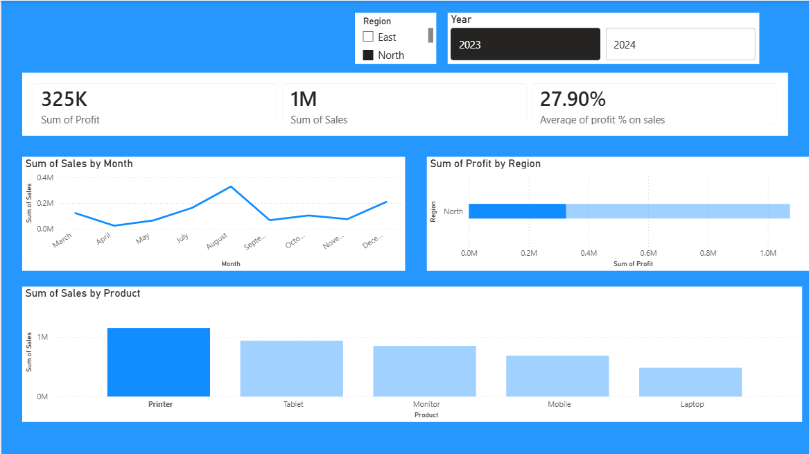

# Sales Dashboard Analysis

## 📊 Project Overview
An interactive data analytics project designed to track, visualize, and analyze retail sales performance. This project processes raw sales data to uncover regional trends, product performance, and key profitability metrics.

## 📷 Dashboard Preview

## 🛠️ Tools Used
* **Language:** Python
* **Environment:** Power BI / Jupyter Notebook
* **Libraries:** Pandas

## 💡 Key Business Metrics Tracked
* Total Revenue & Profit Margins
* Monthly Sales Growth Trends
* Top Performing Product Categories
* Regional Sales Distribution
